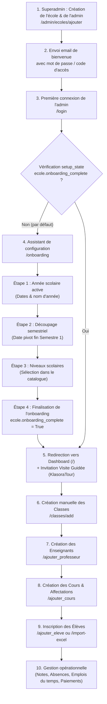

# 🎓 EDUMANAGE

### Plateforme de gestion scolaire intelligente

## 🧠 Présentation

**EDUMANAGE** est une application web complète de gestion scolaire permettant de centraliser et automatiser les opérations d’un établissement éducatif.

Elle permet de gérer :

* les élèves
* les enseignants
* les cours
* les notes
* les paiements
* les absences
* les bulletins

Le système est conçu avec une architecture **multi-écoles**, permettant à plusieurs établissements d’utiliser la même plateforme en toute sécurité.

---

## 🚀 Fonctionnalités principales

### 🔐 Authentification & rôles

* Connexion sécurisée avec limitation des tentatives (anti-bruteforce)
* Gestion des rôles :

  * Admin
  * Super Admin
  * Enseignant / Professeur
  * Parent
* Sessions sécurisées

---

### 🏫 Gestion multi-écoles

* Isolation des données par école
* Sécurité avancée par filtrage (`ecole_id`)
* Super admin avec gestion globale

---

### 👨‍🎓 Gestion des élèves

* Ajout / modification / suppression
* Attribution à une classe
* Association à un parent
* Inscription automatique aux cours
* Génération de code parent + QR code
* Notifications email

---

### 👨‍🏫 Gestion des professeurs

* Création de comptes enseignants
* Attribution aux classes et cours
* Génération automatique de code d’accès
* Notification email

---

### 📚 Gestion des cours

* Création et organisation par classe
* Attribution à un professeur
* Gestion des coefficients
* Suivi des activités

---

### 📝 Gestion des notes

* Ajout de notes par enseignant
* Calcul automatique des moyennes
* Filtrage par année scolaire
* Accès parent sécurisé
* Notifications automatiques aux parents

---

### 💰 Gestion des paiements

* Suivi des frais scolaires
* Paiements mensuels
* Statistiques (complet / partiel / impayé)
* Tableau de bord financier

---

### 📊 Export & reporting

* Export PDF (relevé de notes)
* Export Excel (élèves, notes)
* Génération de bulletins
* Rapports détaillés

---

### 📡 API & fonctionnalités avancées

* API JSON pour classes et élèves
* Limitation des requêtes (Flask-Limiter)
* Journalisation des actions (logs)
* Sécurité renforcée multi-écoles 

---

## ⚙️ Technologies utilisées

* **Backend** : Python (Flask)
* **ORM** : SQLAlchemy
* **Authentification** : Flask-Login
* **Sécurité** : Flask-Limiter, Bcrypt
* **Base de données** : SQLite
* **Export** : Pandas, ReportLab
* **Notifications** : Email (SMTP)
* **Autres** : QR Code, JSON API

---

## 🏗️ Architecture

Le projet est structuré en modules :

* `routes.py` → logique principale (auth, élèves, cours, etc.)
* `models.py` → base de données
* `forms.py` → formulaires
* `middleware` → sécurité multi-écoles
* `utils` → fonctions auxiliaires
* `notifications` → email

---

## 🚀 Installation

```bash
git clone https://github.com/moctargoumarattama/EDUMANAGE.git
cd EDUMANAGE
```

Créer un environnement virtuel :

```bash
python -m venv .venv
.venv\Scripts\activate
```

Installer les dépendances :

```bash
pip install -r requirements.txt
```

Configurer les variables d’environnement :

```env
MAIL_USERNAME=your_email@gmail.com
MAIL_PASSWORD=your_app_password
```

Lancer l’application :

```bash
python run.py
```

---

## 🔐 Accès

* Les comptes doivent être créés par un administrateur
* Les parents accèdent uniquement aux données de leurs enfants
* Les enseignants accèdent uniquement à leurs classes
* Les données sont isolées par école

---

## 🎯 Objectif du projet

Ce projet a été réalisé dans un cadre pédagogique avec pour objectifs :

* concevoir une application web complète
* maîtriser Flask et SQLAlchemy
* implémenter une architecture multi-utilisateurs
* gérer la sécurité et la séparation des données

---

## 💡 Améliorations futures

* Application mobile (Flutter)
* Tableau de bord analytics avancé
* Notifications en temps réel
* API publique
* Hébergement cloud scalable

---

## 👨‍💻 Auteur

Projet réalisé par **Moctar Goumar Attama**

---

## 📌 Remarque

Ce projet est une solution éducative avancée pouvant évoluer vers une plateforme SaaS professionnelle.


------------------------------------------------


Viewed auth.py:80-160
Viewed auth.py:1-85
Searched for "def onboarding"
Viewed dashboards.py:225-285
Viewed onboarding.html:1-100
Viewed index.html:1-120
Viewed index.html:121-240
Viewed index.html:241-343
Viewed base.html:60-140
Viewed base.html:380-450
Viewed base.html:451-520
Viewed base.html:521-600
Viewed base.html:601-680
Viewed base.html:681-740
Viewed base.html:741-830
Viewed base.html:831-910
Viewed base.html:911-980
Viewed base.html:981-1040
Viewed base.html:1041-1122
Viewed onboarding.js:1-100
Viewed eleves.html:1-100
Viewed eleves.html:101-250
Viewed eleves.html:300-350
Viewed classes.html:1-100
Viewed classes.html:170-230
Viewed ajouter_eleve.html:1-120

Voici un **audit complet d'ergonomie et d'accessibilité cognitive (UX / UI)** pour un nouvel utilisateur (Directeur, Secrétaire ou Administrateur d'école) qui découvre **KLASORA**, ainsi que des solutions concrètes d'optimisation **sans toucher au code**.

---

# 📊 Audit d'utilisabilité & prise en main (Onboarding & Usage quotidien)

### 1. Les points forts déjà existants dans l'application
- **Le wizard d'initialisation obligatoire (`/onboarding`)** : Lorsqu'une école est créée, l'administrateur est guidé étape par étape (Année scolaire ➔ Semestres ➔ Offre pédagogique). C'est un excellent point qui empêche d'avoir une base vide incohérente.
- **La visite guidée interactive (`KlasoraTour`)** : Une invitation à un parcours guidé avec mise en avant des éléments clés (*Spotlight*).
- **L'alerte contextuelle sur la création d'élève** : Si aucune classe n'existe, un bandeau jaune prévient clairement avec un bouton d'action *"Créer une classe"*.
- **Le groupement par classe dans la page Élèves** : L'affichage en accordéon par classe permet de ne pas être submergé par 500 élèves d'un coup.

---

### 2. Les points de friction majeurs pour un nouveau venu (Audit des difficultés)

| Zone / Parcours | Constat actuel | Impact sur le nouvel utilisateur | Niveau de sévérité |
| :--- | :--- | :--- | :---: |
| **A. Clarté du Dashboard (`/`)** | Le tableau de bord affiche **4 cartes statistiques** + **8 modules d'administration** côte à côte (Périodes, Années, Emplois du temps, Rapports, QR Codes, Classes, Nouvelle classe, Synchronisation). | **Surcharge cognitive ("Paradoxe du choix")** : Le nouvel utilisateur ne sait pas par où commencer sa journée ni quelle est l'action prioritaire (inscrire un élève ? créer les cours ? assigner les profs ?). | 🔴 Élevé |
| **B. Ordre logique des dépendances scolaires** | KLASORA suit une chaîne logique stricte : *Année ➔ Niveaux ➔ Classes ➔ Cours/Matières ➔ Professeurs ➔ Élèves ➔ Notes/Paiements*. | Si le nouvel utilisateur va directement sur *"Ajouter un élève"* avant d'avoir configuré ses classes, ou sur *"Ajouter un cours"* sans professeur, il rencontre des blocages successifs. | 🔴 Élevé |
| **C. Vocabulaire technique vs Vocabulaire scolaire** | Termes comme *"Synchronisation hors-ligne"*, *"Journal de correction"*, *"Quarantaine"*, *"Emploi du temps - ajouter un créneau"*. | Certains termes sont perçus comme "techniques / informatiques" plutôt que comme des termes du quotidien d'un secrétariat d'école. | 🟡 Moyen |
| **D. Densité du menu de navigation (Navbar)** | Les menus déroulants contiennent beaucoup d'options : *Scolarité (Classes, Cours, Notes, Absences, Emplois)*, *Suivi (Point du jour, Paiements, Bulletins, Alertes, Rapports)*, *Paramètres (Comptes, Profil, Années, Email)*. | Sur mobile ou petit écran, un novice met du temps à repérer où se trouve l'action qu'il recherche (ex : faire l'appel du matin ou enregistrer un versement). | 🟡 Moyen |
| **E. Visite guidée facultative ou zappée** | Si l'utilisateur clique sur *"Plus tard"*, il se retrouve seul face aux 12 boutons du dashboard sans fil conducteur. | Absence de liste de contrôle (*Checklist*) de démarrage affichée en permanence tant que l'établissement n'est pas opérationnel à 100%. | 🔴 Élevé |

---

### 3. Propositions de solutions (Recommandations stratégiques)

#### Recommandation 1 : La Checklist de démarrage "Premiers pas" (Quick Start Guide)
Plutôt qu'un simple tour d'écran qui disparaît en quelques clics, intégrer sur le tableau de bord d'un nouvel administrateur un bloc dynamique **"Bien démarrer votre rentrée"** avec une jauge de progression (ex : 3/5 étapes terminées) :
1. ✅ **Étape 1 : Année & Semestres configurés** (Déjà fait par l'onboarding).
2. ⬜ **Étape 2 : Créez vos classes** *(Lien direct + indication : "ex : 6ème A, CM2...")*.
3. ⬜ **Étape 3 : Ajoutez vos matières / cours** *(Lien direct)*.
4. ⬜ **Étape 4 : Invitez vos professeurs** *(Lien direct)*.
5. ⬜ **Étape 5 : Inscrivez ou importez vos élèves** *(Lien vers le modèle Excel ou le formulaire)*.
> *Ce bloc se masque automatiquement ou se réduit une fois que l'école a au moins 1 classe, 1 cours, 1 prof et 1 élève.*

#### Recommandation 2 : Réorganisation visuelle du Tableau de bord par "Rituels scolaires"
Au lieu de lister 8 boutons d'administration en vrac, regrouper les actions en 3 grandes familles naturelles :
1. **Actions quotidiennes (Le Quotidien) :**
   - Inscrire un élève / Encaisser un paiement / Pointer les absences / Point du jour.
2. **Organisation pédagogique (La Structure) :**
   - Classes, Cours & Matières, Professeurs, Emplois du temps.
3. **Fin de période & Bilan (L'Évaluation) :**
   - Saisie des notes, Calcul des bulletins, Statistiques globales.

#### Recommandation 3 : Simplification et raccourcis d'action rapide (+ "Action Rapide")
- Ajouter un bouton flottant ou un menu rapide **"＋ Nouveau"** bien visible (style bouton d'action principal) qui permet en 1 clic d'accéder aux 4 actions les plus fréquentes :
  - *Nouvel élève*
  - *Nouveau versement / paiement*
  - *Nouvelle note*
  - *Nouvelle absence*
- Cela évite à l'utilisateur de naviguer dans les arborescences de sous-menus pour les gestes les plus répétés.

#### Recommandation 4 : Messages et états vides rassurants (Empty States pédagogiques)
Dans les pages encore vides (ex : page *Paiements*, *Cours* ou *Classes* d'une nouvelle école) :
- Éviter les simples messages *"Aucun élément trouvé"*.
- Remplacer par un état vide illustré et didactique avec un conseil clair, par exemple :
  > *"Vous n'avez pas encore créé de classe pour l'année 2026-2027. Commencez par créer votre première classe pour pouvoir y inscrire des élèves et y assigner des professeurs."* [Bouton : Créer ma première classe].

#### Recommandation 5 : Bouton "Besoin d'aide sur cette page ?" contextuel
- Un bouton discret d'aide (`?`) en haut à droite de chaque vue complexe (ex: page *Paiements* ou *Bulletins*) qui ouvre une modale résumant en 3 phrases simples comment fonctionne l'écran en cours et les règles de calcul associées (ex : la différence entre année active et année archivée, comment annuler un paiement, etc.).

---

### Résumé pour prise de décision

1. **Est-ce facile d'accès aujourd'hui ?**
   - **Pour les tâches guidées (onboarding de départ)** : **Oui, 8/10**. Le parcours d'inscription initial est clair et verrouillé.
   - **Pour les 30 premières minutes en autonomie** : **Moyen, 5.5/10**. L'utilisateur voit trop de menus en même temps et peut se perdre dans les dépendances (*"Par quoi je commence ?"*).
2. **Actions prioritaires recommandées** :
   - Mettre en place la **Checklist "Premiers pas"** sur le Dashboard pour les nouveaux comptes.
   - Clarifier les **Empty States** avec des boutons d'orientation.
   - Ajouter le menu d'accès rapide **"＋ Nouveau"** pour les tâches quotidiennes récurrentes.


   -------------------------------------


   Viewed ecoles.py:95-165
Viewed ecoles.py:550-606
Viewed models.py:115-165
Viewed models.py:50-114
Viewed models.py:1-50
Searched for "class Ecole("
Searched for "class Ecole"
Searched for "class Ecole"
Viewed models.py:175-235
Viewed utils.py:190-250
Viewed utils.py:245-285
Viewed dashboards.py:280-380
Viewed classes.py:80-140
Viewed classes.py:190-250
Viewed classes.py:251-300
Viewed professeurs.py:110-160
Viewed professeurs.py:161-210
Viewed cours.py:50-120
Viewed cours.py:190-250
Viewed cours.py:251-320
Viewed eleves.py:100-160
Viewed eleves.py:350-430
Viewed eleves.py:431-480

# 📋 AUDIT UX & ARCHITECTURE LOGICIELLE : PARCOURS D'UNE NOUVELLE ÉCOLE SUR KLASORA

---

## 1. CARTOGRAPHIE ÉTAPE PAR ÉTAPE (WORKFLOW COMPLET)



---

### DÉTAIL TECHNIQUE DE LA CHAÎNE

| Étape | URL | Contrôleur / Fichier | Template | Modèles sollicités |
| :--- | :--- | :--- | :--- | :--- |
| **1. Création École & Admin** | `/admin/ecoles/ajouter` | [`app/routes/ecoles.py`](file:///c:/Users/hp/Desktop/EDUMANAGE/app/routes/ecoles.py#L105-L165) | `admin/ajouter_ecole.html` | [`Ecole`](file:///c:/Users/hp/Desktop/EDUMANAGE/app/models.py#L176), [`Utilisateur`](file:///c:/Users/hp/Desktop/EDUMANAGE/app/models.py#L320) |
| **2. Authentification Admin** | `/login` | [`app/routes/auth.py`](file:///c:/Users/hp/Desktop/EDUMANAGE/app/routes/auth.py#L106-L160) | `login.html` | [`Utilisateur`](file:///c:/Users/hp/Desktop/EDUMANAGE/app/models.py#L320), [`Ecole`](file:///c:/Users/hp/Desktop/EDUMANAGE/app/models.py#L176) |
| **3. Déclenchement Onboarding** | `/` (interception) | [`app/routes/auth.py`](file:///c:/Users/hp/Desktop/EDUMANAGE/app/routes/auth.py#L70-L73) | Redirige vers `/onboarding` | [`get_school_setup_state`](file:///c:/Users/hp/Desktop/EDUMANAGE/app/utils.py#L190-L276) |
| **4. Wizard Onboarding** | `/onboarding` | [`app/routes/dashboards.py`](file:///c:/Users/hp/Desktop/EDUMANAGE/app/routes/dashboards.py#L228-L375) | `onboarding.html` | [`AnneeScolaire`](file:///c:/Users/hp/Desktop/EDUMANAGE/app/models.py#L54), [`PeriodeBulletin`](file:///c:/Users/hp/Desktop/EDUMANAGE/app/models.py#L700), [`AnneeNiveauConfig`](file:///c:/Users/hp/Desktop/EDUMANAGE/app/models.py#L153) |
| **5. Tableau de Bord & Tour** | `/` | [`app/routes/auth.py`](file:///c:/Users/hp/Desktop/EDUMANAGE/app/routes/auth.py#L66-L84) | `index.html` + `js/onboarding.js` | Statistiques annuelles, [`Utilisateur.admin_tour_version`](file:///c:/Users/hp/Desktop/EDUMANAGE/app/models.py#L350) |
| **6. Création de Classes** | `/classes/add` | [`app/routes/classes.py`](file:///c:/Users/hp/Desktop/EDUMANAGE/app/routes/classes.py#L225-L300) | `ajouter_classe.html` | [`Classe`](file:///c:/Users/hp/Desktop/EDUMANAGE/app/models.py#L400), [`NiveauScolaire`](file:///c:/Users/hp/Desktop/EDUMANAGE/app/models.py#L98) |
| **7. Création Enseignants** | `/ajouter_professeur` | [`app/routes/professeurs.py`](file:///c:/Users/hp/Desktop/EDUMANAGE/app/routes/professeurs.py#L161-L210) | `ajouter_professeur.html` | [`Professeur`](file:///c:/Users/hp/Desktop/EDUMANAGE/app/models.py#L500), [`Utilisateur`](file:///c:/Users/hp/Desktop/EDUMANAGE/app/models.py#L320) |
| **8. Création des Cours** | `/ajouter_cours` | [`app/routes/cours.py`](file:///c:/Users/hp/Desktop/EDUMANAGE/app/routes/cours.py#L281-L320) | `cours.html` | [`Cours`](file:///c:/Users/hp/Desktop/EDUMANAGE/app/models.py#L600), liaison [`Classe`](file:///c:/Users/hp/Desktop/EDUMANAGE/app/models.py#L400) + [`Professeur`](file:///c:/Users/hp/Desktop/EDUMANAGE/app/models.py#L500) |
| **9. Inscription Élèves** | `/ajouter_eleve` ou `/import-excel` | [`app/routes/eleves.py`](file:///c:/Users/hp/Desktop/EDUMANAGE/app/routes/eleves.py#L350-L480) | `ajouter_eleve.html` | [`Eleve`](file:///c:/Users/hp/Desktop/EDUMANAGE/app/models.py#L250), [`Inscription`](file:///c:/Users/hp/Desktop/EDUMANAGE/app/models.py#L450), [`Utilisateur`](file:///c:/Users/hp/Desktop/EDUMANAGE/app/models.py#L320) (parent) |

---

## 2. ANALYSE CRITIQUE DES SOUS-SYSTÈMES

### A. Création de l'école & Première connexion
- **Mode de création** : Exclusivement administré par le `super_admin` (`/admin/ecoles/ajouter`). Il n'y a **pas d'auto-inscription publique (self-service signup)**. Le super-admin saisit : Nom, Adresse, Téléphone, Email admin et un mot de passe (ou code 8 chiffres généré automatiquement).
- **Critère de déclenchement du Wizard** : Dans `app/routes/auth.py:70-72`, à chaque accès à `/`, la fonction `get_school_setup_state(ecole_id)` vérifie `ecole.onboarding_complete`. Si `False`, l'utilisateur est **systématiquement renvoyé vers `/onboarding`**, sans possibilité de naviguer sur le tableau de bord.
- **Arrêt du Wizard** : L'onboarding ne se termine que lorsque l'utilisateur valide l'action `finaliser` à l'étape `complete` (`ecole.onboarding_complete = True`).

### B. Configuration initiale & Branding
- **Où se trouvent ces réglages ?** :
  - Nom, adresse, téléphone, directeur, ville : configurables dans `/profil-ecole` ([`app/routes/ecoles.py:564`](file:///c:/Users/hp/Desktop/EDUMANAGE/app/routes/ecoles.py#L564)).
  - Logo de l'école : upload validé avec Pillow dans `/profil-ecole`.
  - Cachet et signature : champs existants sur le modèle `Ecole` (`cachet_path`, `signature_path`), mais gérés séparément.
- **Obligation** : **Aucune obligation**. Le wizard d'onboarding ne demande **jamais** de logo, ni d'adresse, ni de devise. L'école est initialisée avec le logo par défaut (`default_logo.png`). Un administrateur pressé peut fonctionner sans jamais renseigner son identité visuelle, ce qui générera des bulletins et cartes scolaires sans logo personnalisé.

### C. Calendrier scolaire & Périodes
- **Création de l'année scolaire** : Se fait à l'étape 1 du wizard (`/onboarding`, action `creer_annee`). L'administrateur choisit l'année de départ (ex: 2026 pour 2026-2027), les dates de début et de fin. L'année est immédiatement créée avec le statut `active`.
- **Découpage des périodes** : Étape 2 du wizard (`action=configurer_semestres`). La plateforme est câblée en **semestres (Semestre 1 et Semestre 2)** via `app.services.semestres.configurer_semestres_annee`. L'utilisateur ne choisit pas entre trimestres et semestres lors de l'onboarding : la logique applique le découpage semestriel.

### D. Structure pédagogique (Niveaux & Classes)
- **Niveaux** : Étape 3 du wizard (`action=configurer_pedagogie`). L'utilisateur sélectionne parmi le catalogue national de KLASORA (Maternelle, Primaire, Collège, Lycée) les niveaux qu'il propose. Ces niveaux sont enregistrés dans `AnneeNiveauConfig`.
- **Classes** : **Zéro classe préremplie par défaut**. L'utilisateur termine l'onboarding avec une offre pédagogique activée, mais **sans aucune classe physique**.
- Il doit ensuite se rendre manuellement sur `/classes/add` pour créer ses classes (ex: "6ème A", "CM2 B"). Le formulaire calcule automatiquement le nom à partir du niveau choisi et d'une section optionnelle.

### E. Corps enseignant & Matières (La chaîne des Cours)
- **Création des professeurs** : Se fait sur `/ajouter_professeur`. Chaque professeur reçoit un compte utilisateur avec un code d'accès à 8 chiffres.
- **Création des matières / cours** : Il n'y a pas de catalogue de matières prédéfini par niveau. Sur `/cours`, l'administrateur doit créer chaque cours unitairement en spécifiant :
  - Le libellé du cours (ex: "Mathématiques"),
  - Le coefficient,
  - La classe cible (obligatoire, issue de l'année consultée),
  - Le professeur affecté (optionnel : peut être "Non affecté").
- **Fragmentation** : Pour ouvrir une classe complète (ex: 6ème A avec 8 matières et 6 professeurs différents), l'administrateur doit répéter 8 fois le formulaire d'ajout de cours, ou assigner les professeurs un par un a posteriori via `/cours/<id>/professeur`.

### F. Arrivée des élèves & Inscription
- **Options d'intégration** :
  1. Formulaire unitaire `/ajouter_eleve` : enregistre l'état civil, le parent (création à la volée du compte parent avec mot de passe/code), les frais annuels, et crée l'enregistrement `Inscription` annuel.
  2. Import Excel `/import-excel` : import par lot via fichier `.xlsx` selon un modèle préétabli.
- **Règle absolue** : **Un élève ne peut pas être créé sans classe**. Si aucune classe n'existe dans l'école pour l'année active, le formulaire bloque la soumission avec un message flash d'erreur.

### G. Le système de guidage actuel
- **Wizard `/onboarding`** : Très rigoureux sur les 3 premières étapes (Année ➔ Semestres ➔ Niveaux). Mais il s'arrête brutalement à l'étape "Prêt" sans créer de classe ni proposer d'en créer une immédiatement.
- **Visite guidée (`KlasoraTour`)** : Une modale s'affiche à l'arrivée sur le dashboard ("Voulez-vous découvrir les principales fonctions... ?").
  - Si acceptée, elle met en surbrillance successive 8 éléments statiques du dashboard (Élèves, Professeurs, Classes, Cours, Années, Emploi du temps, Paiements, Rapports).
  - Si l'utilisateur clique sur **"Plus tard"**, la visite ne s'affiche plus et l'utilisateur se retrouve devant un écran complet sans guide pas-à-pas pour les étapes suivantes.

---

## 3. LES RUPTURES DE CHAÎNE & IMPASSES (POINTS DE BLOCAGE NOVICE)

```
[Onboarding Terminé]
        │
        ▼ (Rupture 1 : L'école est vide)
[Dashboard : 12 cartes d'actions simultanées]
        │
        ├──► Choix A : L'utilisateur clique sur "Ajouter un élève"
        │         │
        │         ▼ (Rupture 2 : Impasse)
        │    "Aucune classe disponible dans votre établissement !"
        │    Bloqué net. Doit faire demi-tour.
        │
        ├──► Choix B : L'utilisateur clique sur "Ajouter un cours"
        │         │
        │         ▼ (Rupture 3 : Double dépendance)
        │    Aucune classe sélectionnable dans la liste.
        │    Aucun professeur disponible.
        │
        └──► Choix C : L'utilisateur crée une Classe
                  │
                  ▼
             Classe créée, mais maintenant :
             - Pas de cours rattachés
             - Pas de professeur principal
             - Pas d'élèves
```

### Rupture n°1 : Le "Trou noir" post-onboarding (De l'onboarding au Dashboard)
- **Constat** : Le wizard valide l'onboarding à l'étape "Niveaux", puis redirige vers `/`. À cet instant, l'école a une année et des niveaux enregistrés, mais **0 classe, 0 professeur, 0 matière, 0 élève**.
- **Impact novice** : L'écran d'accueil affiche les statistiques à zéro et 8 cartes de navigation générale sans hiérarchie. Rien n'indique formellement : *"Étape suivante : Créez vos classes avant d'inscrire vos élèves"*.

### Rupture n°2 : L'impasse de l'inscription prématurée d'élève
- **Constat** : Le réflexe n°1 d'un chef d'établissement qui commence est souvent : *"Je vais inscrire mes élèves"*.
- **Impact novice** : S'il clique sur *"Ajouter un élève"* avant d'avoir créé au moins une classe, il tombe sur un formulaire bloqué avec le message *"Aucune classe disponible dans votre établissement. Un élève doit obligatoirement être inscrit dans une classe"*. Bien qu'un bouton de redirection existe, l'expérience est perçue comme un échec.

### Rupture n°3 : L'obligation d'avoir une arborescence complète pour exploiter les modules
- **Constat** : Pour que le module *Notes* ou *Bulletins* fonctionne, il faut :
  `Année Active` ➔ `Semestres` ➔ `Classe` ➔ `Cours` ➔ `Professeur` ➔ `Élève inscrit` ➔ `Note saisie`.
- Si un seul maillon manque (par exemple, cours créé mais pas de professeur assigné, ou classe créée sans cours), l'enseignant ne voit pas la classe dans son espace, ou le bulletin reste vide.

### Rupture n°4 : La saisie manuelle et répétitive des cours par classe
- **Constat** : Il n'existe pas de bouton *"Appliquer les matières standard du niveau"* (ex: pour une 6ème, créer automatiquement Français coef 4, Maths coef 4, Histoire coef 2, etc.). L'administrateur doit créer chaque matière de chaque classe une par une. Pour 10 classes de 8 matières, cela représente 80 formulaires de création de cours.

---

## 4. MATRICE DES DONNÉES MINIMALES POUR QU'UNE ÉCOLE SOIT "OPÉRATIONNELLE"

| Niveau de préparation | Données requises en base | État dans KLASORA | Ce qui fonctionne | Ce qui est bloqué |
| :--- | :--- | :--- | :--- | :--- |
| **Niveau 0 : Création** | `Ecole`, `Utilisateur` (admin) | `onboarding_complete = False` | Connexion admin | Tout le dashboard (redirigé vers `/onboarding`) |
| **Niveau 1 : Structure initiale** | `AnneeScolaire` (active), `PeriodeBulletin` (S1, S2), `AnneeNiveauConfig` | `onboarding_complete = True` | Dashboard accessible | Impossible d'inscrire des élèves ou de faire cours |
| **Niveau 2 : Structure physique** | Au moins 1 `Classe` sur l'année active | `Classe` active | Inscription d'élèves débloquée | Notes et bulletins impossibles (aucun cours) |
| **Niveau 3 : Pédagogie active** | Au moins 1 `Professeur` + 1 `Cours` rattaché à la classe | `Cours`, `Professeur` | Espace prof débloqué, emploi du temps possible | Pas d'évaluation possible tant qu'il n'y a pas d'élèves |
| **Niveau 4 : 100% Opérationnel** | Au moins 1 `Eleve` avec `Inscription` annuelle | Tous les modèles liés | **Notes, Bulletins, Paiements, Emploi du temps, Absences, Cartes scolaires** | Rien, l'école tourne à plein régime |

---

## 5. SYNTHÈSE GLOBALE & NIVEAU DE DIFFICULTÉ POUR UN NOVICE

### Note de difficulté actuelle : 6.5 / 10 *(Moyennement difficile à intimidant)*

### Forces :
1. **Sécurité de l'onboarding** : L'obligation de définir l'année, les semestres et les niveaux avant d'entrer dans l'application empêche 100% des erreurs d'incohérence temporelle (orphelins d'année).
2. **Garde-fous stricts** : L'application n'autorise pas la création d'élèves flottants sans classe annuelle, ce qui protège l'intégrité de la base de données.
3. **Visite guidée intégrée** : Le spotlight tour permet de repérer les noms des modules.

### Faiblesses UX majeures :
1. **Absence de pont entre l'Onboarding et la première Classe** : La fin de l'onboarding lâche l'utilisateur sur le dashboard général sans lui dire explicitement que sa première tâche obligatoire est d'ajouter une classe.
2. **Effet "Cockpit d'avion"** : Le dashboard présente immédiatement tous les modules (QR codes, logs, synchro hors-ligne, périodes, rapports, paiements) au même niveau visuel, submergeant le débutant d'options prématurées.
3. **Charge de saisie initiale des matières** : L'absence de génération groupée des cours/matières standard oblige à une configuration fastidieuse avant de pouvoir exploiter la saisie des notes et les bulletins.


A FA5re    Niveau 3 : Assistant analytique en langage naturel (Pour les directeurs)
 Rôle : Interroger les chiffres de l'établissement en français (« Donne-moi la liste des élèves ayant plus de 3 absences non justifiées cette semaine », « Quel est le taux de recouvrement des frais pour la classe de 6ème A ? »).
 Fonctionnement : L'IA traduit la question en requête de données filtrée strictement sur l'ID de l'école connectée (⁠ecole_id⁠).